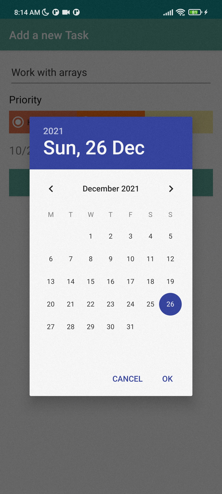

# Todoist
---

## [Github Link](https://github.com/gauravkharel/DMA_TodoApp.git) ##

<h2 align="center">
  Todoist: Todo App for the DMA Component 2. 
</h2>

---

#  `MVMM`

## Implemented Features

#1 Sign Up          
---
 

---

#2 Login
---

---

#3 Add Task
---

---

#4 Update Task
---

---

#5 Delete Task
---

---

#6 Calender Integration
---

---

#7 Navigation Menu
---

---

#8 Toggle Menu
---

---
---

---

# `App Usage`
### ***1 Sign Up:*** By providing essentials credentianls, register as a user to the app.
### ***2 Login:*** Log in with the credentials used while Sign Up.
##### ***3 Todo List:*** Click the (+) icon to add new task. You can input the Task Name and Date to completion.

#### ***4 Update Tasks:*** Click the todo item to edit the task as required. 
#### ***5 Delete the todo items and list:*** Delete the finished task by swiping the task widget to left/right.
#### ***6 Logout :*** Logout from the toggle menu using Logout button. 
#### ***7 More Info/Contact Details :*** From toggle, go to More where you find About App and Contact Details by toggling the menu.  

---
---

# `Design Architecture of app`
# MODEL
* `adapter`  consists of recyclerviews adapters. 
-`TasksAdapter`  
-`TabsAdapter`  

* `Database` consists of dao(class for room database) ,UserAuthentication,db.. 
-`DataAccessObject` 
-`AppDatabase` 
-`DateConvert` 
-`UserDatabase` 

-`TodoListsTasks` 

# VIEW
* `Activity`  consists of main activity 
-`MainActivity`  
-`RegsterActivity`  
-`LoginActivity`  
-`TabsActivity`  
* `Fragments` consists of all fragments 
-`AboutFragments` 
-`ContactFragments` 

# ViewModel
* `MainActivityVieModel`   

---
---

# `References`
## `Resources used to create this App`

[Room persistance library](https://developer.android.com/topic/libraries/architecture/room)  
[Paint class holds the style and color information about how to draw geometries, text and bitmaps](https://developer.android.com/reference/android/graphics/Paint)  
[LayoutInflater](https://developer.android.com/reference/android/view/LayoutInflater)  
[Handling Lifecycles with Lifecycle-Aware Components](https://developer.android.com/topic/libraries/architecture/lifecycle)  
[Navigation Components](https://developer.android.com/guide/navigation/navigation-getting-started)  
[TypeConverter](https://developer.android.com/reference/android/arch/persistence/room/TypeConverter)  

---
